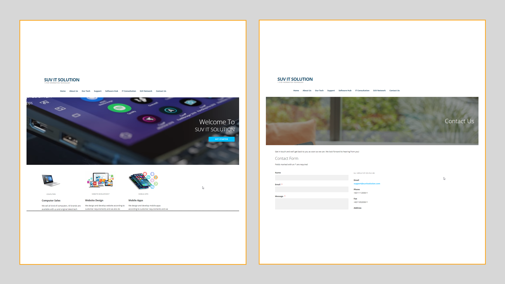

## Project
> ### E-Commerce site project

## Client
**SUV IT Solutions Penang Malaysia**

> An e-commerce site that provides one-stop solution for all IT needs

## URL
[link to the site!](http://www.suvitsolution.com/)

## Tools used
* Wordpress
* WooCommerce Plugin

> Training has been provided to Client to maintain the site

## Status
> **Completed and LIVE**

## Screenshots

  |  |  |  | 
------|------| -----|------|----- 
[Home](https://ajaymy.github.io/freelance-projects/) | [Realtime Monitoring App](realtime) | [Single Page App](singlepage) | [Medical lab site](lab) | [Education site](education)

