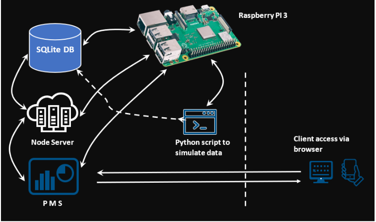
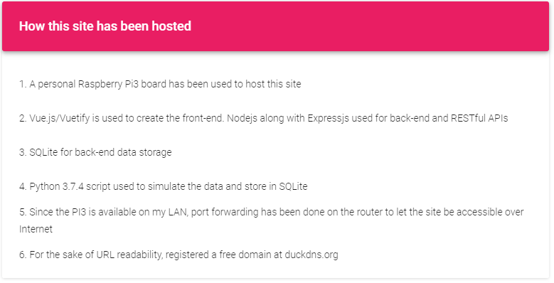
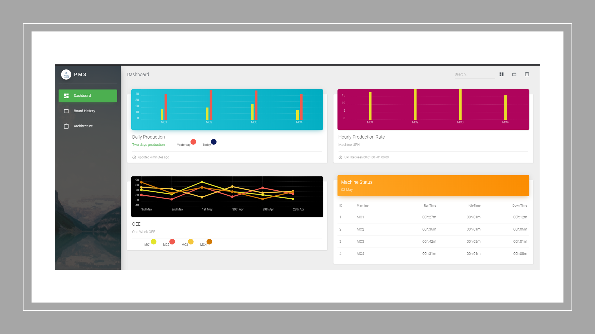

## Project
> ### Real-time Monitoring Application

## Implementation
**The app was developed to try and implement my knowledge on the below mentioned tools**

## Overview
The basic architecture of the application is as below

> 

## Hosting
[link to self-hosted site!](http://rootit.duckdns.org:3000/)

> 

## Tools used

> 

## Status

> **Not in LIVE but self hosted**

## Screenshots

  |  |  |  | 
------|------| -----|------|----- 
[Home](https://ajaymy.github.io/freelance-projects/) | [Single Page App](projects/singlepage) | [E-Commerce site](ecommerce) | [Medical lab site](lab) | [Education site](projects/education)

