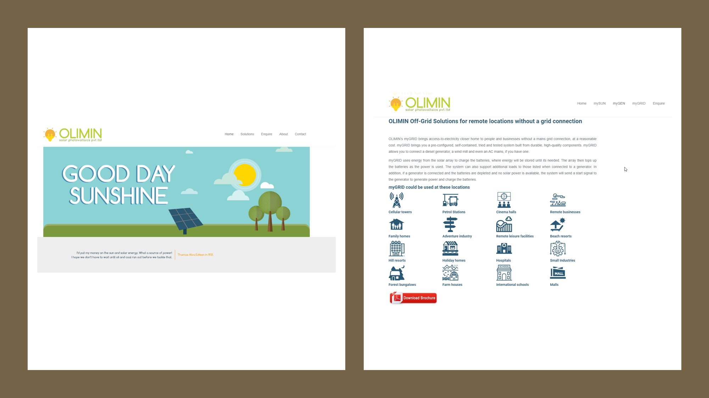

## Project
> ### Single Page Application

## Client
**Olimin - India**

> A solar-energy solution provider.

## Self-hosting URL
[link to self-hosted site!](http://olimin.duckdns.org:9000/)

1. A personal Raspberry Pi3 board has been used to host this site
2. Since the PI3 is available on my LAN, port forwarding has been done on the router to let the site be accessible over Internet
3. For the sake of URL readability, registered a free domain at duckdns.org

## Tools used
* Bootstrap
* jQuery 

## Status
> **Not in LIVE but self hosted**

## Screenshots

  |  |  |  | 
------|------| -----|------|----- 
[Home](https://ajaymy.github.io/freelance-projects/) | [Realtime Monitoring App](projects/realtime) | [E-Commerce site](ecommerce) | [Medical lab site](lab) | [Education site](projects/education)

